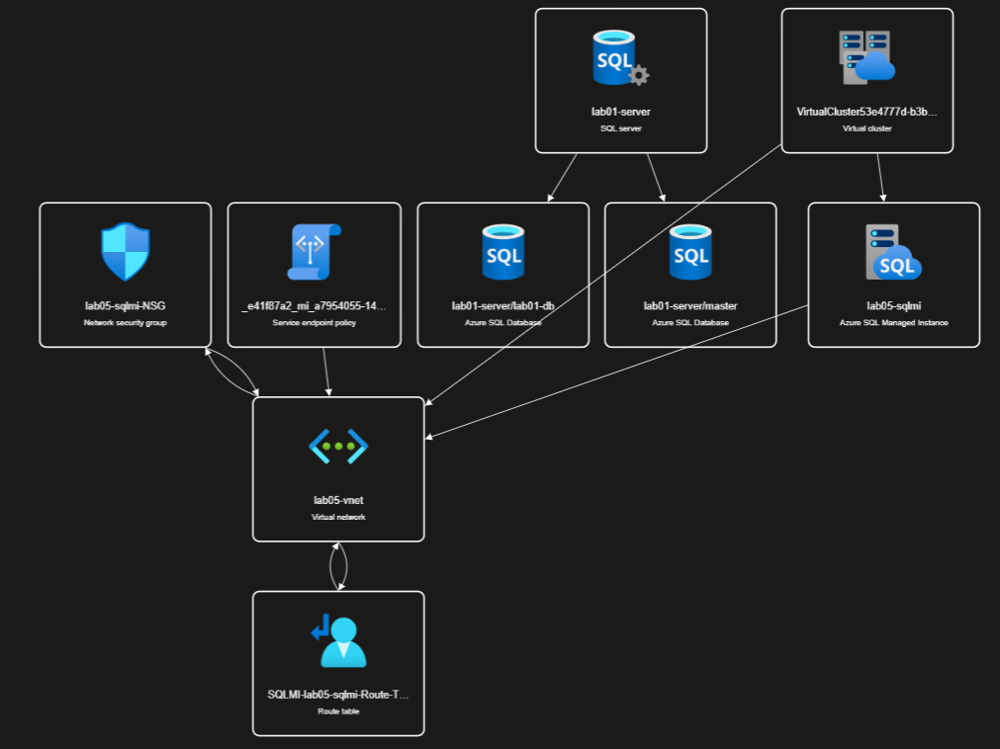

**Step-by-Step Guide to Deploy Bicep Scripts in Azure**

NOTE: Lab 05, and Lab 06 shares the same setup. If you have completed Lab 05, you don't need to setup resources for Lab 06. 

**Prerequisites**:
1. **Azure Login**:
   Ensure that you are logged into your Azure account where the Bicep scripts will be deployed. You can log in using the Azure CLI with the following command:
   ```bash
   az login
   ```

2. **Check Permissions**:
   After logging in, verify that you have Contributor permissions in the resource group intended for deployment. Replace `your-rg-name` with the name of your resource group. This script checks for the 'Contributor' role assignment:
   ```bash
   az role assignment list --assignee $(az account show --query user.name -o tsv) --resource-group "your-rg-name" --query "[?roleDefinitionName=='Contributor']" -o table
   ```
   If the output table shows your user account, you have the necessary permissions. If not, contact your Azure administrator to gain the required access.

**Deployment Process**:
1. **Navigate to the Directory**:
   Change to the directory containing your `main.bicep` file. Execute the following command in your command prompt or terminal:
   ```bash
   cd .\06_Manage_and_Optimize_AzureSQLMI\Modules
   ```

2. **Deploy to a Specific Resource Group**:
   To deploy the resources to your existing resource group, use the following command. Replace `your-rg-name` with the resource group name and `your-subscription-guid` with your subscription ID. Ensure that the resource group is provisioned in advance, as the Bicep script does not create the resource group automatically:
   ```bash
   az deployment group create --name "lab06-deploy" --resource-group "your-rg-name" --template-file main.bicep --parameters .\params.bicepparam --subscription "your-subscription-guid"
   ```
   
## Final Result


---